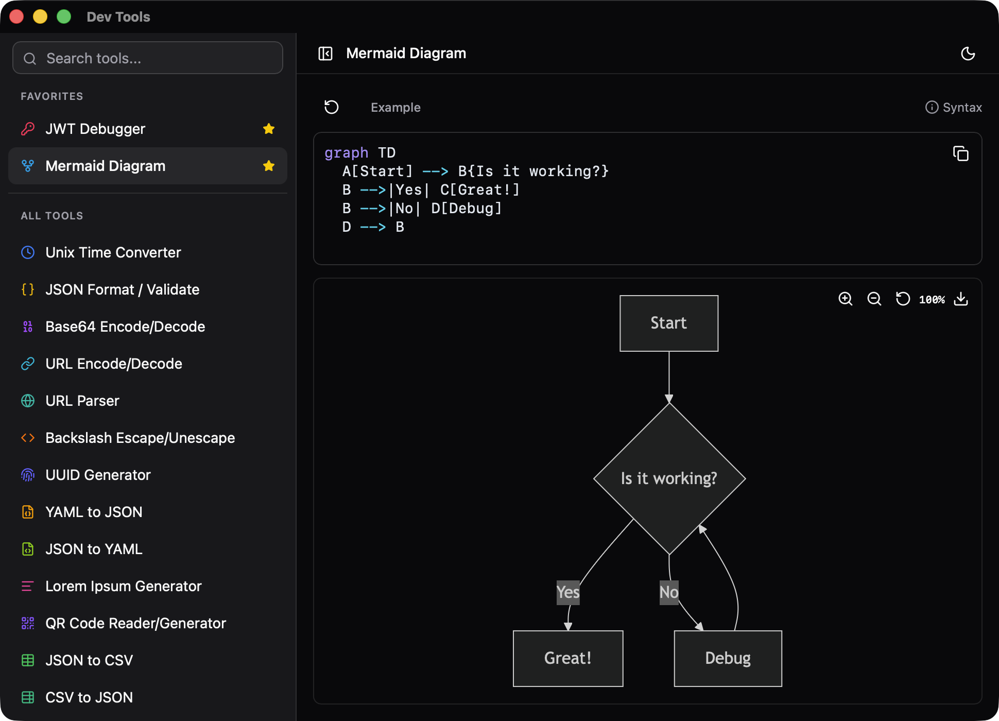

# Dev Tools

A local-first collection of developer utilities built with React, Vite, and TypeScript.



## Tools

- Time: Unix timestamp converter and cron parser.
- Data: JSON formatting and validation, YAML/JSON conversion, JSON/CSV conversion.
- Encoding: Base64, URL component encoding, and backslash escape tools.
- Web: URL parser and Mermaid diagram renderer.
- Security: JWT debugger and hash generator.
- Generators: UUID, lorem ipsum, random string, and QR code tools.

## Getting Started

Install dependencies:

```bash
bun install
```

Run the development server:

```bash
bun run dev
```

Build for production:

```bash
bun run build
```

Preview the production build:

```bash
bun run preview
```

## Quality Checks

```bash
bun run typecheck
bun run lint
bun run test
bun run test:ui
bun run test:coverage
```

## Tech Stack

- React 19
- Vite 7
- TypeScript
- Tailwind CSS
- Vitest and Playwright browser tests
